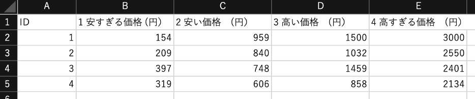
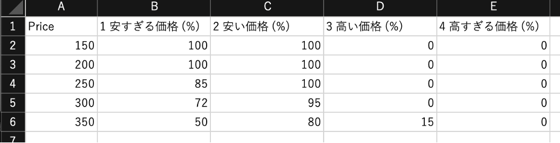
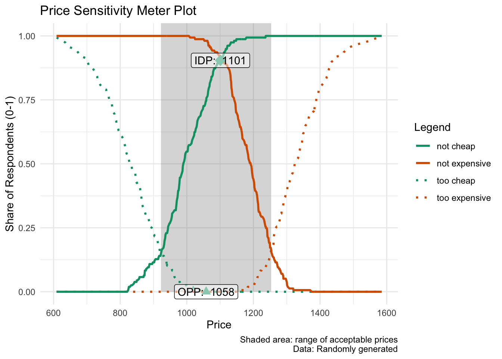
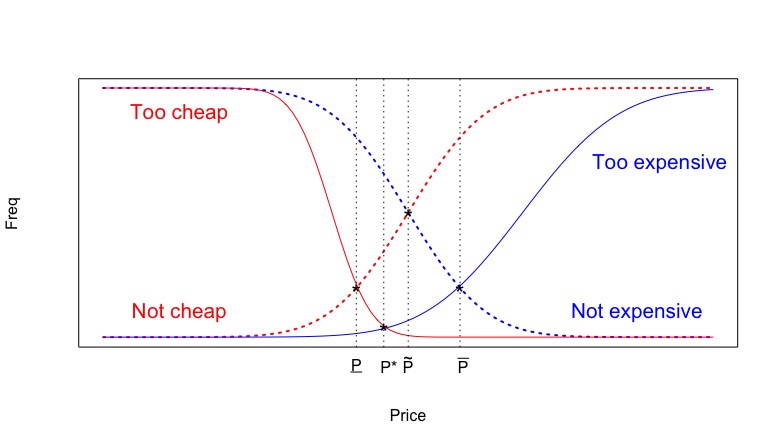
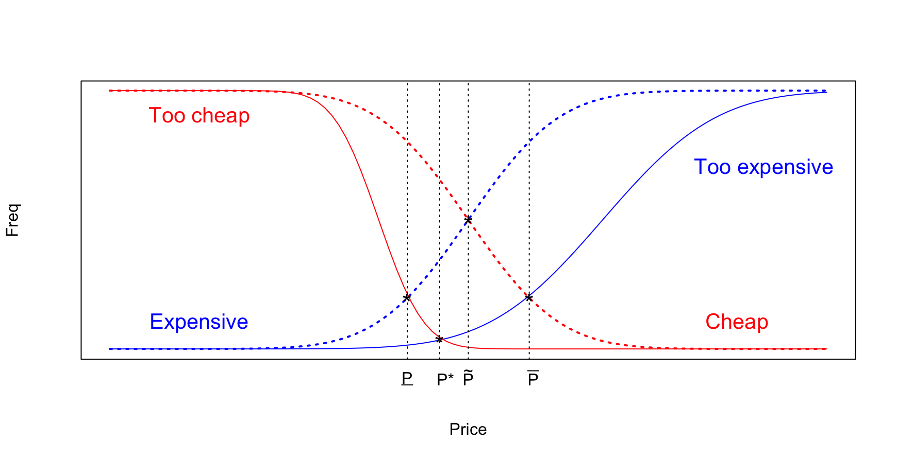

# 価格感度測定 (PSM) {#psm}
本章は、田頭（2025）の第12章に対応する内容である。
本ウェブサイトでは価格感度測定の基礎をなす既存研究についての説明は割愛しているため、より詳細な説明については、以下の図書を参照してほしい。

- 田頭拓己（2025）「マーケティングデータ分析: 実務とリサーチをつなぐ」，有斐閣.
  - <https://www.yuhikaku.co.jp/books/detail/9784641166509>
  
## 本章の概要{#Ch10Intro}
価格は、マーケティング意思決定者が調整する重要なマーケティング戦術要因（4Ps）のひとつである。価格は4Psの中で唯一企業にとっての収入を生む要因であり、製品の需要量やイメージにも関連する重要な意思決定項目である。消費者の視点にたてば、価格は自身の予算制約のもとその製品が購入に値するかを判断する定量的かつ認知的な情報であると同時に、品質や高級感を推測するための心理的影響を持つ情報としても機能する。マーケティング意思決定者はこれらを踏まえ、製品のマーケティング戦略や目標と一貫するように価格を設定する必要がある。しかしながら、どの程度の価格で販売すれば、消費者が安い/高いと感じるのだろうか。本章では、「消費者が知覚する価格水準」について理解するための方法として、価格感度測定（Price Sensitivity Meter; PSM）という手法を説明する。

PSMは、消費者に製品の価格に関する4つの質問を提示し、その質問への回答に基づき消費者の知覚する価格の特徴について知見を得る方法である。そのため、PSMはマーケティング戦術決定に役立つ調査・分析手法でありながら、高度な分析手法を用いる必要がない。また、Rを使用する場合、分析についても非常に容易である。このことから、この手法はアンケート調査による簡便なアプローチとして広く実務的に用いられている。

本章では、Rを用いたPSM の分析手法と結果の解釈に加えて、PSM に関する学術的背景についても説明することで、「PSM が何を明らかにしようとしているのか」を直感的に理解できるようになることを目的とする。そのために本章では、以下の順でPSMについての説明を行う。第一に、PSMでどのような情報を得ることができるのかを概観するため、PSMで用いる調査・分析方法を紹介する。PSMでは、ある特定の製品に対して、（1）安すぎて買わない価格、（2）やすいと感じる価格、（3）高いと感じる価格、（4）高すぎて買わない価格、について「〇〇円」という形で回答してもらうように質問項目を設計する。そして、集計結果に基づき、任意の価格水準に対してどのように（例えば、安すぎるや、安い、高い、高すぎると）感じている消費者がどれだけいるか、頻度を計算する。この頻度に基づき、市場（回答者）における受容価格域、無差別価格、最適価格を導出する。これらの算出される結果を適切に解釈するためには、PSMの背景にある学術的議論について理解する必要がある。

そのため第二に、PSMの背景に存在する学術的議論について簡単に触れる形で価格概念について説明する。マーケティング領域では、消費者の価格への知覚として、「安すぎて不安だから買いたくない」という価格を下限、「高くて買えない」という価格を上限とする形で、消費者が受容する（製品を買う）価格帯が存在すると考える。このような価格帯を受容価格帯と呼ぶ。また、この受容価格帯の範囲内において自身の持っている基準から消費者自身が「高い」や「安い」と感じる価格のことを内的参照価格と呼ぶ。PSMは主にこれらの価格受容帯と内的参照価格とを捉える形で市場（回答者）における価格の特徴を特定化する手法だと言える。

PSM は，本章を執筆している2025年中にその重要性が増したように感じている。PSM は製品の価格決定を補助するための調査・分析方法だが、企業の製品価格の決定では、製造企業の生産にかかる費用をもとに、企業が利益を得るという観点から適切な価格決定が行われることがある。一方で、市場に存在する消費者が製品の価格についてどう感じるかも同時に重要である。PSMは後者の観点から、適切な価格域を探索する方法だといえる。例えば2025年に米の価格が高騰したことを受け、日本政府は備蓄米を5月から放出した。これについて当時総理大臣を務めた石破茂氏は同年5月に「5キロ3000円台」を目指すと宣言した（日本経済新聞, 2025）。米の価格高騰や備蓄米放出の放出に関する議論の際に頻繁に用いられたのが「適正な価格」という表現だ。では，ここで語られていた適正さとはどのような基準で考えられたのだろうか。当時の米価上昇の背景には、生産費用の高騰や収穫量の減少などの要因が重なっていた。一方で消費者に受け入れられる価格という点については本章で紹介するPSM の枠組みを用いて調査・分析を行うことによって，市場に存在する消費者が抱く価格への評価や反応についてのより慎重な調査や議論ができたかもしれない。米に限らず、生産費用が高騰していく経済状況においてはに企業は値上げについての意思決定に迫られる。その際に、自社の主要商品の価格に対して、消費者がどう感じているのかを調査・計測していくことは重要だろう。なお、PSMに関連する既存研究や学術的背景については、別途テキストを参照してほしい。

また、本章の最後にはPSMに関する説明でよく見られる実践的な注意点も紹介する。PSMの実行においては、本章で紹介する方法とは異なる、一般的には誤用と考えられているアプローチを活用しているケースも多く見られる。本章では主にWestendorp型と呼ばれているPSM法に焦点を合わせ説明しているが、誤用とされる方法は主にNMS（Newton, Miller, and Smith）型と呼ばれる。オンライン上では、特に断りなくNMS型を使用・参照している記事も多い。試しにオンライン上で「価格感度測定」と検索すると、公共性が高く信頼できそうなソースであっても、NMS型を紹介しているウェブサイトを確認する事ができる。本章では、NMS型アプローチがなぜ好ましくないのか、そしてなぜそれが広まったのかという経緯についても説明を加える。


## PSMの実行と結果{#psmrunning}
PSMは、消費者の心理的側面を踏まえた価格に関する含意の提示を目的としている。そのためにPSM では、4つの質問項目を用いて消費者の価格に対する認識を捉える。なお、質問においては、消費者の価格に関する知覚について知りたい対象（製品やサービス）を特定化する必要がある。例えば、具体的な設問の前に、製品の画像や情報を提示することで、回答者が参照する製品やサービスを特定化することも有効になる。その上で、PSMでは以下の4つの質問によって調査を行う。

1. （ある製品に対して）安すぎて買わない価格
  - 例：「（この製品を買う［サービスを利用する]のに）価格がいくらより低いと、買うには安すぎて品質に不安を感じますか？; （回答）〇〇円」
2. 安いと感じる価格
  - 例：「（この製品を買う［サービスを利用する]のに）価格がいくら以下だと、安いと感じますか？; （回答）〇〇円」
3. 高いと感じる価格
  - 例：「（この製品を買う［サービスを利用する]のに）価格がいくら以上だと、高いと感じますか？; （回答）〇〇円」
4. 高すぎて買わない価格
  - 例：「（この製品を買う［サービスを利用する]のに）価格がいくら以上だと、買うには高すぎると感じますか？; （回答）〇〇円」

なお、これらの回答の回答によって得た４つ価格は、$4 > 3 > 2 > 1$ という関係が成り立っている必要がある。これらの質問への回答により得たデータは、以下の図のように回答者ベースの構造をもつはずである。

{width=70%}

PSMでは、上記のデータから各価格レンジ（以下の例では、x円以下形式）に対して、安すぎる、安い、高い、高すぎる、と感じる人がどの程度いるかを集計する。ある価格水準に対し、安い（高い）や安すぎる（高すぎる）と感じる回答者がどれだけいるのかという（相対）頻度を求めることで分析を行う。以下の表はPSMでの集計を簡単に示したデータ構造である。

{width=70%}

Rを用いた分析においては、自身でデータ構造の変換を行う必要はない。Rでは、"pricesensitivitymeter" というパッケージの `psm_analysis()`という関数を用いることで分析を実行でき、PSM用データ構造への集計作業もこのパッケージが行ってくれる。

ここからは、実際にRを用いたPSMの実行手順を紹介する。まず分析の実行に際し、このパッケージをインストールし、起動する。


``` r
install.packages("pricesensitivitymeter")
library(pricesensitivitymeter)
library(tidyverse)
```


続いて、"psm_ex.csv" という演習用データを読み込み、`psm_ex` として定義する。


``` r
psm_ex <- read.csv("data/psm_ex.csv", na = ".")
head(psm_ex)
```

```
##    tch   ch   ex  tex
## 1  963 1016 1242 1318
## 2  866 1082 1272 1303
## 3  795  824 1290 1297
## 4  812  933 1211 1335
## 5 1026  818 1228 1289
## 6  912  987 1195 1395
```

このデータは、ある製品への価格について、安すぎる（tch）、安い（ch）、高い（ex）、高すぎる（tex）という上記4つの価格認識について、250人の消費者から回答を得た（と仮定する）人工データである。分析の実行においては以下のように、`psm_analysis()` という関数において `toocheap`、`cheap`、`expensive`、`tooexpensive`という引数を用いて、データセットにおけるどの変数がPSMで用いる価格情報に対応するのかを指示する必要がある。


``` r
output_psm <- psm_analysis(
  toocheap = "tch",
  cheap = "ch",
  expensive = "ex",
  tooexpensive = "tex",
  data = psm_ex
)

summary(output_psm)
```

```
## Van Westendorp Price Sensitivity Meter Analysis
## 
## Accepted Price Range: 923 - 1253 
## Indifference Price Point: 1101 
## Optimal Price Point: 1058 
## 
## ---
## 157 cases with individual price preferences were analyzed (unweighted data).
## Total data set consists of 250 cases. Analysis was limited to cases with transitive price preferences.
## (Removed: n = 93 / 37% of data)
```

`psm_analysis()` の実行結果として、Accepted price range（受容価格域）、Indifference price point（無差別価格）、Optimal price point（最適価格）が提示される。今回の分析の結果を見れば、受容価格域は `923-1253`、無差別価格は `1101`、最適価格は `1058` である。受容価格域とは、安すぎると感じる人と高すぎると感じる人が少ない価格域を表している。 また無差別価格とは、高いと感じる人と安いと感じる人がつりあっていて、高くもなく安くもない価格である。一方で最適価格とは、高すぎたり安すぎたりして買わないという人が最も少ない（受容する人が最も多い）価格である。

また、PSMでは分析結果を図示化する慣習もあるが、これも `psm_plot()` という関数を用いて、ggplot 形式のコマンドで簡単に出力できる。


``` r
psm_plot(output_psm) +
  labs(
    x = "Price",
    y = "Share of Respondents (0-1)",
    title = "Price Sensitivity Meter Plot",
    caption = "Shaded area: range of acceptable prices\nData: Randomly generated") +
  theme_minimal()
```

<div class="figure">

<p class="caption">(\#fig:psmfigure)PSM Plot</p>
</div>

上記の図では、受容価格価格域、無差別価格、最適価格というそれぞれの結果が、"too cheap"（安すぎる）曲線、"too expensive"（高すぎる）曲線、"not cheap"（安いと感じない）曲線、"not expensive"（高いと感じない）曲線の交点によって導かれていることがうかがえる。では、これらの価格に関する概念がどのようなもので、なぜこれらに着目するのだろうか。実は、Rの分析結果に `Van Westendorp Price Sensitivity Meter Analysis` と記載されているように、PSMは既存の研究によって提示された価格についての考え方および調査方法である（Van Westendorp, 1976）。次節以降では、これらの結果の背景にはどのような理論や先行研究の知見があるのかについて詳しく述べる。

## マーケティングにおける価格概念{#price_concept}
本節では、PSMの結果への理解を深めるために、マーケティングにおけるいくつかの価格概念を紹介する。PSMは消費者の内的な価格に対する認識や基準を集計する方法である。消費者の購買に関わる最も基本的な価格概念に、支払い意思額（Willingness to Pay: WTP） がある。WTPは、消費者が特定の製品に対して「最大いくらまで払ってもいい」と考えているかを捉えた価格である。単純化された理論的世界観のもとでは、消費者はある製品の価格が、自身の WTP を下回る場合には、その製品を購入すると考えられる。

しかしながら、消費者の心理的側面を考慮すると、価格が安ければいいというわけでもない。我々の日常的な買い物においては、ある製品が自身のWTPより高いので買えないということに加えて、安すぎる価格によって、（製品品質などに）不安を抱き買いたくないと考えることもあるだろう。製品やサービスの品質が事前にわからない場合、人々はなんらかの情報に基づいて品質を類推するが、価格がその手がかりになると考えられる。このように、製品の価格が安すぎても、高すぎても買ってもらえず、どうやら消費者にとって、ちょうどいい価格幅がありそうだといえる。そして、「安すぎて不安だから買いたくない」という価格から「高くて買えない」という価格で示される、消費者が受容する（製品を買う）価格帯のことを、受容価格帯（Accepted price range）という。

もう一つの心理的側面を捉えた価格概念に、内的参照価格がある。我々の日常的な買い物を振り返ると、自身が買える価格の範囲内であっても、その価格が高いもしくは安いと感じることはあるだろう。内的参照価格は、買い手がその価格が妥当かどうか判断する際の基準となる、個人の価値観を反映した価格である。つまり内的参照価格は、「高すぎて買えない」や「安すぎて買いたくない」というほど極端な価格ではないが、自身の持っている基準から消費者自身が「これは安いな」とか「これは高いな」と感じることを捉えた価格概念である。ただし、内的参照価格は対象となる製品やサービスの価値だけではなく、消費者個人の経験や他の関連製品の価格にも影響を受けることに注意が必要である。PSM では主に、受容価格と内的参照価格を中心に分析・図示化を行っていると理解できる。

## 受容価格帯と内的参照価格帯の応用とPSM{#Accprice}
PSM は、受容価格帯と内的参照価格帯に関わる知見に基づき提案されている価格決定手法である。PSMの特徴は、「安すぎる価格」、「安い価格」、「高い価格」と「高すぎる価格」の4つの質問に対する個人の価格水準を回答してもらう点にある。PSMでは特定の価格を提示しその価格に対する消費者の評価を得るという方法ではないことにも注意が必要である。つまり、「この製品が〇〇円だったらどのように感じますか？：1. 安い,...,7.高い」のような質問形態を取らない。

PSMでは、4つの質問から得た回答をもとに、価格の変化に対する安い（または高い）と感じる人と安すぎる（高すぎる）と感じる人の累積比率を計算し図示化していくのだが、もう一点注意するべき点がある。それは、「高いと感じる人」の比率と「安いと感じる人」の比率を１（または100%）から引き、「高いと感じない人」と「安いと感じない人」についての比率を示す曲線を描画するということである。これらの高い（安い）と感じない人の比率を示した曲線は高い（安い）と感じる人の比率を反転させたもの（兼子，2014）や余事象（岸など，1999）と呼ばれている。以下の図は、「高い（安い）と感じない」という形に反転させた状態でのPSM分析結果例を表現した比率曲線である。下図のうち、"Too expensive" （青い実線）と "Too cheap"（赤い実線） 曲線はそれぞれ高すぎると安すぎる（と感じる人の）比率を表しており、"Not expensive" （青い破線）と "Not cheap"（赤い破線）曲線は高いと感じないと安いと感じない人の比率を示している。

<div class="figure">

<p class="caption">(\#fig:psmfig)PSM結果例</p>
</div>


PSMでは、上図内の各曲線の交点から、最適価格（$P^*$）、無差別価格（$\tilde{P}$）、最高価格（$\bar{P}$）、最低価格（$\underline{P}$）を算出する。$P^*$ は、受容価格帯に基づく価格点である。$P^*$は高すぎると感じる人と安すぎると感じる人の比率が最も少なくなり、受容不可能な消費者が最小となる価格である。$\tilde{P}$ は内的参照価格に基づく価格点である。$\tilde{P}$は、「安いと感じない」曲線と「高いと感じない」曲線の交点であり、安いとも高いとも感じない消費者が最多となる価格帯であり、\@ref(internal)節 の図 \@ref(fig:acceptfig) における $P_3-P_2$の範囲内だと感じている消費者が最も多い価格だと解釈できる。

それ以外の価格点の解釈は比率の余事象（例、高いと感じない、安いと感じない）を求めることで容易になっている。$\bar{P}$ は、高すぎると高いと感じないの曲線の交点である。この点は、「高いとは思うが高すぎるわけではない」と感じる消費者が多い点である。この点よりも低い価格では高いと感じる人が少ない（高くないと感じる人が多い）が、この点よりも高い価格では高すぎると感じる人が多くなる。言い換えると、前節における $P_4-P_3$ の範囲内だと感じている消費者が多い価格だと解釈できる。一方で $\underline{P}$ は安すぎると安いと感じないという二つの曲線の交点である。この点は、「安いとは思うが安すぎるわけではない」と感じる消費者が多い点であり、前節における $P_2-P_1$ の範囲内だと感じている消費者が多い価格だと解釈できる。


本節で述べた通り、PSMの分析結果では受容価格と内的参照価格に基づいて提示される価格水準や価格帯である。PSMは調査方法も（Rによる）分析方法も簡便であるが、それだけに結果の解釈については注意が必要である。例えば、PSMの分析結果において「最適価格」という言葉が用いられるが、この価格水準は、受容する人が最も多いことを示しており、他の文脈で用いられうる「最適」を意味しないことに注意が必要である。同様に、その他の価格帯・水準についても受容価格帯と内的参照価格帯との関連から解釈することが可能になる。PSMを利用する際には、その前提となる知識に基づき、結果に対する適切な解釈を行うことが重要になる。

## 集計方法に関する注意点{#westendopNMS}
これまで紹介したPSMアプローチは、Westendorp (1976) によって提唱された方式であるが、、Newton et al. (1993) によって提唱された別のアプローチも広く採用されている。Newton et al. (1993) による方式（NMS型）でも、これまで説明した方式と同様の4つの質問を用いて最適価格、無差別価格、最高価格、最低価格を提示する。しかしながら、NMS型においては「高いと感じる」と「安いと感じる」消費者の比率の余事象は取らずに分析を行う。NMS型もPSMとして広く用いられているものの、Newton et al. (1993) が誤った方法を紹介したことを起点に広まったとされている（兼子，2014）。

NMS型の PSM を用いると、最適価格と無差別価格は Westendorp 型の方式と等しい結果を得るが、最低価格と最高価格については異なる結果を得る。どちらの数値が正しいのかという点については議論があるものの、NMSは各曲線の交点についての論理的意味が見出しにくいという　大きな欠点を有している（兼子，2014）。

NMS型の考え方を簡易的に図示化する。安いおよび高いと感じる曲線を 1 (もしくは100%) から引く形で反転させない場合、最低価格（$\underline{P}$）は「高い」曲線（青い破線）と「安すぎる」曲線（赤い実線）との交点で求められる。これは、先述の図\@ref(fig:acceptfig)  で示されている $P_4-P_2$ の範囲に感じている回答者が多くなる価格を表している。 同様に、最高価格（$\bar{P}$）は安い曲線（赤い破線）と高すぎる曲線（青い実線）の交点で求められる。これは、$P_3-P_1$ の範囲に感じている回答者が多くなる価格を表している。これらのことから、NMS型では、最高価格と最低価格の解釈が困難になると考えられる（兼子，2014）。NMS型でも前節までに説明したものと似た結果を得ることはできるのだが、その結果が既存の価格概念と整合的かつ直感的かという点に関して、問題を有している。

<div class="figure">

<p class="caption">(\#fig:NSMfig)NMS型概要図</p>
</div>

オンライン上では、NMS型のPSMを紹介している記事も散見される。実務的にもNMS型の方法を用いる場合もあるが、PSMの背後にある受容価格と内的参照価格に関する理論的基盤を鑑みると、Westendorp (1976) 方式のPSMアプローチのほうが、より実務的な含意を得やすい方法であると考えられる。PSMは使用の容易さから広く用いられているアプローチではあるが、本資料を読んだ学生においては、その背後に想定されている「受容価格」と「内的参照価格」という価格概念を理解したうえで活用してほしい。

## 参考文献{#Ch10Reference}

Gabor, A., & Granger, C. W. J. (1966). Price as an Indicator of Quality: Report on an Enquiry. Economica, 33(129) 43-70.

兼子良久 (2014). 「Westendorpのprice sensitivity Meterに関する考察-活用上の注意点と粗問題-」, 鹿児島経済論集, 54(1-3), 29-60. 

岸邦宏・内田賢悦・佐藤馨一 (1999). 「航空運賃に対する利用者の価格感度に関する研究」, 土木計画学研究・論文集, 16, 187-194.

日本経済新聞（2025）「石破茂首相「コメ5 キロ3000 円台を実現」下がらなければ責任」，https://www.nikkei.com/article/DGXZQOUA216ED0R20C25A5000000/ より，2025 年8 月14 日取得.

Van Westendorp, P (1976) NSS-Price Sensitivity Meter (PSM) – A new approach to study consumer perception of price. Proceedings of the 29th ESOMAR Congress, 139-167. Online available at https://www.researchworld.com/a-new-approach-to-study-consumer-perception-of-price/.

Newton, D, Miller, J, Smith, P, (1993) A market acceptance extension to traditional price sensitivity measurement. Proceedings of the American Marketing Association Advanced Research Techniques Forum.
